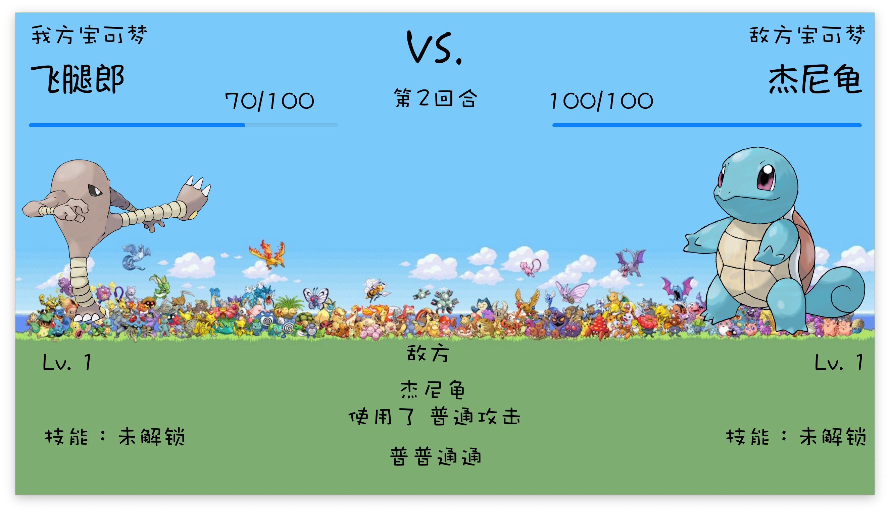

Here is a draft of the README.md file for your GitHub repository, including the provided sections and details:

```markdown
# Pokemon Project

## 软件开发环境

- **编程语言**: C++ 20
- **UI 开发框架**: Qt 6.7.0
- **数据库**: MySQL 8.3.0
- **IDE**: Qt Creator 13.0.2
- **系统**: macOS Sonoma 14.5 (23F79)

## 快速上手

1. 克隆仓库至本地并进入目录：
    ```bash
    git clone https://github.com/Word2VecT/Pokemon.git
    cd Pokemon
    ```
2. 安装对应版本的 Qt，并在 Qt Creator 中配置。
3. 安装 MySQL 数据库，并启动后台监听服务。程序使用数据库用户名为 `root`，密码为空，数据库名为 `Pokemon`，也可以自行修改 `Server/main.cpp` 文件配置为本地。
4. 使用以下命令导入数据库：
    ```bash
    mysql -u root -p < ./Database/Pokemon.sql
    ```
5. 在 Qt Creator 中打开 `Server` 项目，编译运行。
6. 在 Qt Creator 中打开 `Client` 项目，编译运行。
7. Enjoy!

## 模块清单

| 模块名称            | 模块标识符 | 模块说明                         |
|---------------------|------------|----------------------------------|
| 开始窗口            | MainWindow | 开始界面                         |
| 登陆窗口            | LoginDialog| 用于完成登陆、注册功能的窗口     |
| 游戏大厅            | Home       | 游戏大厅                         |
| 背包界面            | Bag        | 显示用户所有的Pokemon 及精灵选择 |
| Pokemon 展示子项    | ListItem   | 在背包或选择中展示Pokemon 基础信息 |
| Pokemon 信息界面    | pokemonInfo| 显示Pokemon 的信息               |
| 用户列表            | Rank       | 显示所有用户的信息               |
| 对战选择            | Battle     | 显示对战种类选择                 |
| 对战界面            | Stadium    | 显示对战过程                     |
| 结果界面            | Result     | 显示对战结果                     |

## 图形界面设计

### 开始界面


### 登录界面


### 游戏大厅


### 用户列表


### 用户信息


### Pokemon 信息界面


### 对战选择界面


### 对战界面



### 对战胜利界面


### 对战失败界面


## 宠物 Pokemon 类设计

设计了宠物 Pokemon 的类, 模拟了精灵的各种属性和行为。精灵的属性包括名字、等级、经验值、攻击力、防御力、生命值、速度、种类和能力。每个精灵有独特的攻击方式，等级提升时属性会相应增加。为了方便扩展，精灵的攻击方法设计为虚方法。

### 类设计

#### 基类：Pokemon

`Pokemon` 类是所有精灵的基类, 包含以下主要属性和方法：

```cpp
#ifndef POKEMON_H
#define POKEMON_H

#include <QString>
#include "config.h"
#include <QRandomGenerator>

// 基类：Pokemon
// 这个类表示一个基本的精灵, 包含了精灵的基本属性和方法
class Pokemon {
    protected:
        int id; // 精灵的唯一标识符

        QString name; // 精灵的名字
        bool evolved; // 精灵是否已进化

        int lv; // 精灵的等级
        int exp; // 精灵的经验值

        int atk; // 精灵的攻击力
        int def; // 精灵的防御力
        int hp; // 精灵的生命值
        int speed; // 精灵的速度

        QString type; // 精灵的种类
        QString ability; // 精灵的能力

    public:
        // 构造函数, 初始化精灵的属性
        Pokemon(QString name = "", int lv = 1, int atk = INIT_ATK, int def = INIT_DEF, int hp = INIT_HP, int speed = INIT_SPEED, QString ability = "");

        // 虚析构函数
        virtual ~Pokemon() {};

        // 获取精灵的名字
        QString getName() const;
        // 获取精灵的唯一标识符
        int getID() const;
        // 获取精灵的等级
        int getLv() const;
        // 获取精灵的经验值
        int getExp() const;
        // 获取精灵的攻击力
        int getAtk() const;
        // 获取精灵的防御力
        int getDef() const;
        // 获取精灵的生命值
        int getHp() const;
        // 获取精灵的速度
        int getSpeed() const;
        // 获取精灵的能力
        QString getAbility() const;

        // 设置精灵的等级
        void setLv(int);
        // 设置精灵的经验值
        void setExp(int);
        // 设置精灵的攻击力
        void setAtk(int);
        // 设置精灵的防御力
        void setDef(int);
        // 设置精灵的生命值
        void setHp(int);
        // 设置精灵的速度
        void setSpeed(int);

        // 判断精灵是否死亡
        bool isDead() const;

        // 虚函数：精灵升级, 需要在派生类中实现
        virtual void lvUp() = 0;
        // 虚函数：精灵攻击另一个精灵, 需要在派生类中实现
        virtual int attack(Pokemon*) = 0;
};

#endif // POKEMON_H
```

#### 派生类：AttackPokemon

`AttackPokemon` 类继承自 `Pokemon` 类, 是可以攻击的精灵类。

```cpp
#ifndef ATTACKPOKEMON_H
#define ATTACKPOKEMON_H

#include "pokemon.h"

// 派生类：AttackPokemon
// 这个类继承自Pokemon, 表示具有攻击能力的精灵
class AttackPokemon : public Pokemon {
    public:
        // 继承基类Pokemon的构造函数
        using Pokemon::Pokemon;

        // 虚析构函数
        virtual ~AttackPokemon() {};

        // 重写基类的纯虚函数lvUp, 实现精灵升级的逻辑
        void lvUp() override;

        // 纯虚函数：精灵攻击另一个精灵, 需要在派生类中实现
        virtual int attack(Pokemon*) override = 0;
};

#endif // ATTACKPOKEMON_H
```

#### 派生类：Charmander

`Charmander` 类继承自 `AttackPokemon`，表示小火龙精灵。

```cpp
Charmander::Charmander(QString name, int lv, int atk, int def, int hp, int speed) : AttackPokemon(name, lv, atk, def, hp, speed, "火花") {}

int Charmander::attack(Pokemon* enemy) {
    int damage = atk - enemy->getDef();
    QRandomGenerator *generator = QRandomGenerator::global();
    int random = generator->bounded(6);
    if (random <= 2) {
        damage *= random;
    }

    if (getLv() > 10 && generator->bounded(100) < getSpeed()) {
        damage += 0.5 * getDef();
    } //灼烧效果
    enemy->setHp(fmax(enemy->getHp() - damage, 0));

    return random;
}
```

#### 派生类：Mankey

`Mankey` 类继承自 `AttackPokemon`，表示猴怪精灵。

```cpp
Mankey::Mankey(QString name, int lv, int atk, int def, int hp, int speed) : AttackPokemon(name, lv, atk, def, hp, speed, "踢倒") {}

int Mankey::attack(Pokemon* enemy) {
    int damage = atk - enemy->getDef();
    QRandomGenerator *generator = QRandomGenerator::global();
    int random = generator->bounded(6);
    if (random <= 2) {
        damage *= random;
    }

    if (getLv() > 10 && generator->bounded(100) < getSpeed()) {
        enemy->setDef(enemy->getDef() - 0.5 * getAtk());
        setAtk(getAtk() + 0.5 * enemy->getDef());
    }//降低敌方防御

    enemy->setHp(fmax(enemy->getHp() - damage, 0));
    return random;
}
```

### 测试程序

```cpp
#include <QCoreApplication>
#include "pokemon.h"
#include "attackpokemon.h"
#include <iostream>

void printPokemonStats(const Pokemon& pokemon) {
    std::cout

 << "Name: " << pokemon.getName().toStdString() << std::endl;
    std::cout << "Level: " << pokemon.getLv() << std::endl;
    std::cout << "Attack: " << pokemon.getAtk() << std::endl;
    std::cout << "Defense: " << pokemon.getDef() << std::endl;
    std::cout << "HP: " << pokemon.getHp() << std::endl;
    std::cout << "Speed: " << pokemon.getSpeed() << std::endl;
    std::cout << "Ability: " << pokemon.getAbility().toStdString() << std::endl;
    std::cout << "Is Dead: " << (pokemon.isDead() ? "Yes" : "No") << std::endl;
}

int main(int argc, char *argv[])
{
    QCoreApplication a(argc, argv);

    // Create some Pokemon instances
    Charmander charmander("Charmander", 5, 52, 43, 39, 65);
    Mankey mankey("Mankey", 5, 80, 35, 40, 70);

    // Print initial stats
    std::cout << "Initial Stats of Charmander:" << std::endl;
    printPokemonStats(charmander);

    std::cout << "\nInitial Stats of Mankey:" << std::endl;
    printPokemonStats(mankey);

    // Attack each other
    std::cout << "\nCharmander attacks Mankey!" << std::endl;
    charmander.attack(&mankey);
    printPokemonStats(mankey);

    std::cout << "\nMankey attacks Charmander!" << std::endl;
    mankey.attack(&charmander);
    printPokemonStats(charmander);

    // Level up Charmander
    std::cout << "\nCharmander levels up!" << std::endl;
    charmander.lvUp();
    printPokemonStats(charmander);

    // Level up Mankey
    std::cout << "\nMankey levels up!" << std::endl;
    mankey.lvUp();
    printPokemonStats(mankey);

    return 0;

    return a.exec();
}
```

### 总结

通过上述设计，精灵类的继承和多态性得到了良好的体现。每种精灵都有其独特的属性和攻击方式，且可以在此基础上进一步扩展新的精灵种类和攻击逻辑。通过测试程序，可以验证各个类及其方法的正确性，确保精灵在游戏中的行为符合设计预期。

## 数据库设计

### 用户表 user

| 表项             | 含义         |
|------------------|--------------|
| userID           | 用户ID       |
| username         | 用户名       |
| password         | 密码         |
| online           | 在线状态     |
| pokemonCnt       | 宝可梦数量   |
| highPokemonCnt   | 高级宝可梦数量 |
| battleCnt        | 战斗次数     |
| battleWinCnt     | 战斗胜利次数 |

### 宝可梦表 pokemon

| 表项        | 含义     |
|-------------|----------|
| pokemonID   | 宝可梦 ID|
| name        | 名称     |
| HP          | 生命值   |
| ATK         | 攻击力   |
| DEF         | 防御力   |
| LV          | 等级     |
| Speed       | 速度     |
| userID      | 主人用户ID |

## 界面设计

Qt 的使用也体现了面向对象的编程思想：

- **类和对象**：Qt广泛使用类和对象来封装数据和功能。每个控件、窗口、对话框等都被封装成类，通过实例化类来创建对象，这些对象负责管理自身的状态和行为。
- **继承**：Qt 利用继承机制来扩展和定制现有的类。通过继承，可以创建新的类并添加或修改功能，而不需要从头开始编写代码。Qt 中许多控件都是从 `QWidget` 或 `QAbstractItemModel` 等基类继承而来的。
- **多态性**：Qt 通过虚函数和接口实现多态性，使得程序可以在运行时选择合适的函数执行。这样可以实现灵活和可扩展的设计。
- **信号与槽机制**：这是Qt的一大特色，用于实现对象之间的通信。对象可以通过信号通知其他对象发生了某个事件，而其他对象可以通过槽函数来处理这些事件。这种机制使得对象之间的耦合度降低，提高了代码的可维护性和可扩展性。
- **属性系统**：Qt提供了一个强大的属性系统，使得对象的属性可以被动态查询和修改。属性系统与信号槽机制结合，可以实现复杂的交互和动态行为。
- **事件处理**：Qt中所有的用户交互（如鼠标点击、键盘输入等）都被封装成事件，通过事件循环进行处理。对象可以通过重写事件处理函数来定制其行为。

通过这些面向对象的设计思想，Qt提供了一个高效、灵活且可扩展的应用开发框架，使得我可以专注于实现应用的业务逻辑，而不用过多关心底层的实现细节。

### 界面流程图

```plaintext
开始界面
    |
    v
登陆界面
    |
    v
游戏大厅 ----------------
   /  \                  \
  v    v                  v
精灵背包  所有用户列表   对战选择界面
  |      |                |
  v      v                v
精灵信息  用户所有宝可梦   对战界面
                          |
                          v
                        结果窗口
          
```

## Socket 通信设计

采用了多客户端并发的 C/S 模式，这样服务器可以和多个客户端通信。采用的方法是单线程的方法。在服务器接收到新的客户端连接时，服务器为该客户端分配一个新的 socketID，并且将 socketID 传回给客户端。与此同时，服务器将套接字加入到服务器的套接字列表中。

在客户端与服务器通信的过程中，客户端在传给服务器的信息中加入 socketID，服务器收到客户端传来的信息，并且做相应的处理之后，将该 socketID 放入到传给客户端的信息中，并且将该信息发送给服务器 socket 列表中的所有客户端。客户端收到信息之后先检查 socketID 是否匹配，若匹配则接收信息，否则不接收。
